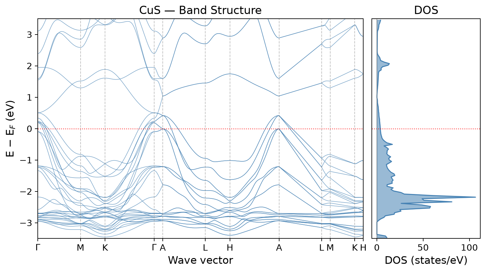
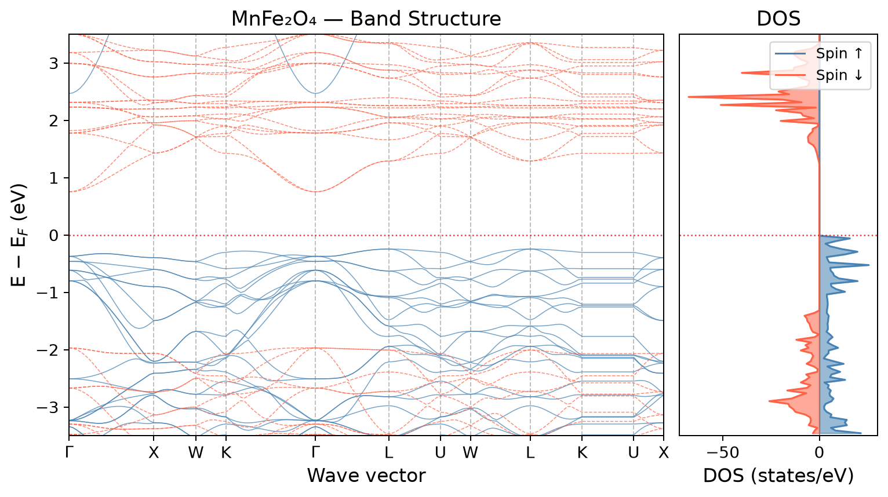
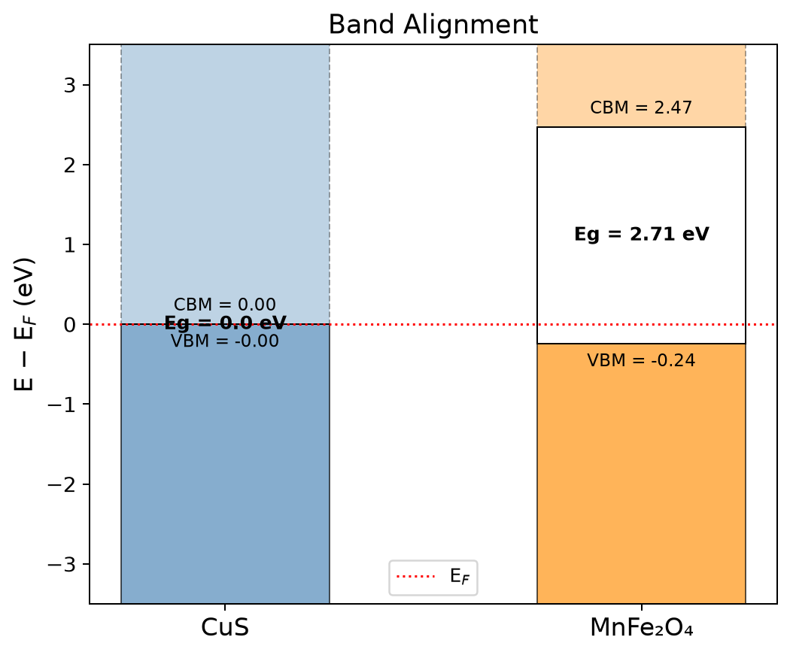

# Band Gap Calculation

Band structure and density of states (DOS) analysis for CuS and MnFe₂O₄ materials, including a composite CuS/MnFe₂O₄ heterojunction study.

## Materials

| Material | Materials Project ID |
|----------|---------------------|
| CuS (Copper Sulfide) | mp-504 |
| MnFe₂O₄ (Manganese Iron Oxide) | mp-18750 |

## Figures

| CuS Band Structure + DOS | MnFe₂O₄ Band Structure + DOS |
|:------------------------:|:-----------------------------:|
|  |  |

## Contents

### Notebooks
- `CuS.ipynb` — Band structure and DOS analysis for CuS
- `MnFe2O4.ipynb` — Band structure and DOS analysis for MnFe₂O₄
- `CuS_MnFe2O4.ipynb` — Combined analysis of the CuS/MnFe₂O₄ heterojunction

### Data Files
- `band_data.csv` — Band structure data
- `mp-504_band_up.csv` / `mp-18750_band_up.csv` / `mp-18750_band_down.csv` — Spin-resolved band data
- `mp-504_DOS.csv` / `mp-18750_DOS.csv` — Density of states data
- `mp-504_kpoints.csv` / `mp-18750_kpoints.csv` — k-point paths
- `mp-504_Fermi_energy.txt` / `mp-18750_Fermi_energy.txt` — Fermi energy values
